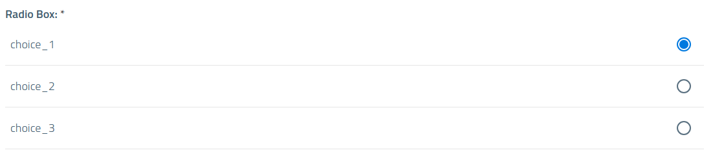
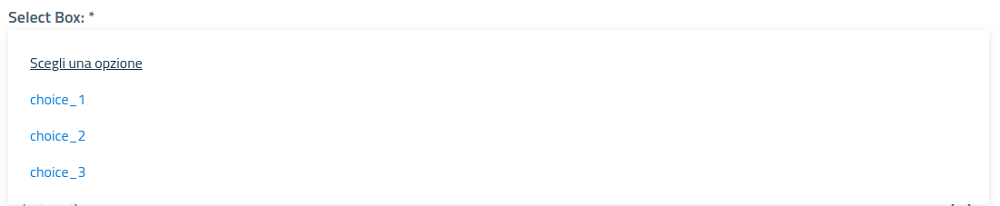
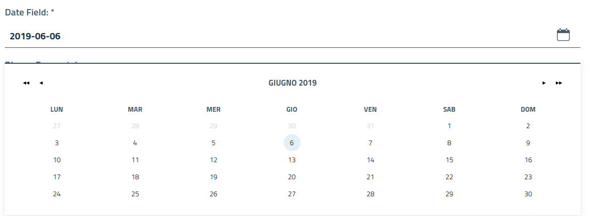
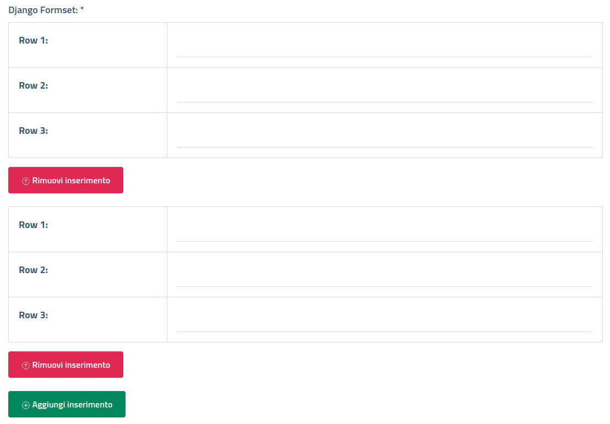
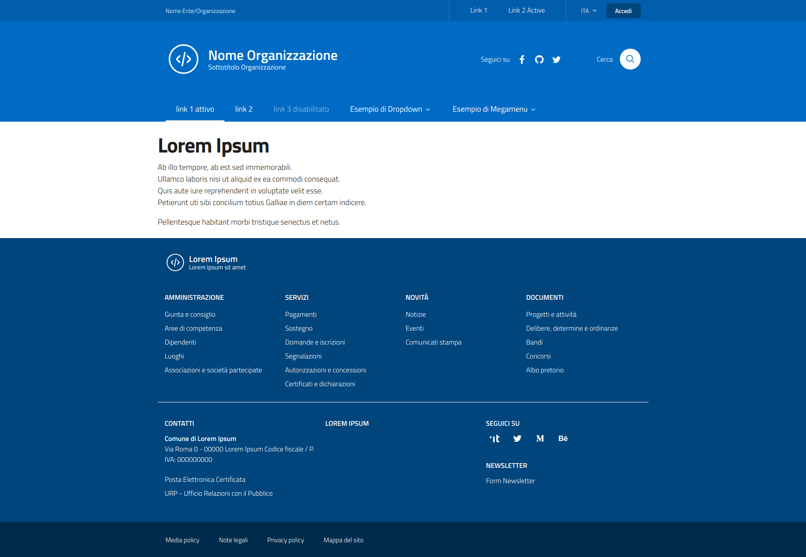

[](https://developersitalia.slack.com/messages/C91K0K085)
[](https://slack.developers.italia.it/)
[](https://forum.italia.it/c/design/user-interface)
[](https://pepy.tech/project/design-django-theme)

Bootstrap Italia template for Django
-----------------------------------------

Completamente open-source, costruita sulle fondamenta di [Bootstrap Italia v1.6.2](https://italia.github.io/bootstrap-italia/),
di cui eredita tutte le funzionalità, componenti, griglie e classi di utilità,
secondo le [Linee Guida di Design per i siti web della Pubblica Amministrazione](https://docs.italia.it/italia/designers-italia/design-linee-guida-docs/it/stabile/).
**Bootstrap Italia** usa i pattern e i componenti definiti nello [UI Kit](https://designers.italia.it/kit/ui-kit/)
di Designers Italia e li trasforma in codice già pronto all'uso.

Questa libreria per il framework Python Django fornisce lo schema di default
del template, opportunamente diviso in blocchi di cui poter fare l'overload,
al fine di dotare il proprio progetto di una interfaccia grafica che rispetti
le Linee guida di design per i servizi web della Pubblica Amministrazione.

[QUI](https://italia.github.io/bootstrap-italia/docs/come-iniziare/introduzione/)
è possibile prendere visione del codice sorgente per l'implementazione di tutti
i componenti grafici messi a disposizione.

Installazione
-------------

```
pip install design-django-theme
```
- In settings.py INSTALLED_APPS inserire *bootstrap_italia_template*.


Utilizzo
--------

```
python manage.py collectstatic
```

- Nel template del progetto, creare un file ```base.html``` (scegliere il nome
preferito) ed eseguire l'*extends* del file ```bootstrap-italia-base.html```. Questa
sarà la base grafica (il file è concepito quasi come un file di configurazione),
comune a tutte (o quasi) le pagine del sistema;
- In ```base.html``` eseguire l'overload dei blocchi, al fine di personalizzare
le sezioni di interesse (es. il nome dell'Ente/Organizzazione, il logo, ecc...);
- Ogni pagina del proprio progetto dovrà estendere ```base.html``` ed effettuare
l'overload del blocco ``````, ereditando, cosi, le impostazioni
di ```<header>``` e  ```<footer>``` opportunamente personalizzate.

Formato data nel datepicker
---------------------------

Per personalizzare il formato della data utilizzato nel widget datepicker (calendario)
dei form, effettuare l'override del parametro ```JS_DEFAULT_DATE_FORMAT``` nel
file ```settings``` del progetto.
Il valore di default è "dd/MM/yyyy".

Stile e CSS/SCSS
----------------

Per la personalizzazione dello stile del template (colori, dimensioni, sfondi),
si consiglia l'utilizzo di SASS 3 (Syntactically Awesome Style Sheets), in modo
da essere in grado di agire in ambito responsive.

Può essere utile [django-sass-processor](https://pypi.org/project/django-sass-processor).

Una volta installate le librerie, sarà possibile integrare fogli di stile *.scss*
e importarli nelle proprie pagine effettuando l'overload del blocco ``````.

CDN vs local
------------

E' possibile recuperare i file statici (css, js, svg) da una CDN.
Nel ```settings.py``` del proprio progetto basta customizzare i seguenti parametri:

- ```DJANGO_BOOSTRAP_ITALIA_USE_CDN``` (default **False**);
- ```DJANGO_BOOSTRAP_ITALIA_CDN``` (default **https://cdn.jsdelivr.net/npm/bootstrap-italia@1.6.2/dist**);

Descrizione dei blocchi
-----------------------

I blocchi sono elencati in ordine di "apparizione" nel file ```bootstrap-italia-base.html```.

| Block                                 | Descrizione           |
| --------------------------------------|---------------------|
| ****            | Tag <title> della pagina   |
| **** | tag <meta-description> della pagina   |
| ****    | tag <meta-keywords> della pagina   |
| ****    | tag <meta-robots> della pagina   |
| **** | Extra CSS o Javascript   |
| **** | Intero blocco Header   |
| **** | Striscia top in Header   |
| **** | Classe per definizione colonne in griglia in "it-header-center-wrapper"   |
| **** | Striscia top left che avvolge header_slim_org_name  |
| **** | Nome organizzazione in Header top   |
| **** | Nome organizzazione in Header top (mobile)   |
| **** | Icona freccia sub-menu in Header top (mobile)   |
| **** | Sub-menu nome organizzazione (mobile)   |
| **** | Area di destra in Header top   |
| **** | Sub-menu area di destra in Header top   |
| **** | Button area di destra in Header top   |
| **** | Wrapper div del logo   |
| **** | Wrapper div del testo del logo   |
| **** | Header logo principale  |
| **** | Nome organizzazione principale in Header   |
| **** | Descrizione organizzazione in Header   |
| **** | Area di destra sezione principale Header  |
| **** | Area icone social in sezione principale Header   |
| **** | Area "Cerca" in sezione principale Header   |
| **** | Area di testo in "Cerca"  |
| **** | Testo "Cerca"   |
| **** | Icona tasto "Cerca"   |
| **** | Menu principale in Header  |
| **** | Voci del menu principale |
| **** | Messaggi di sistema   |
| **** | Messaggi di sistema, centrati, con margin e padding settati   |
| **** | Contenuto della pagina, senza padding e margin   |
| **** | Contenuto della pagina, centrato, con margin e padding settati   |
| **** | Area footer   |
| **** | Striscia top in Footer   |
| **** | Logo Footer  |
| **** | Area nome organizzazione in Footer   |
| **** | Nome organizzazione in Footer   |
| **** | Descrizione organizzazione in Footer   |
| **** | Sezione menu centrali in Footer   |
| **** | Prima colonna in sezione centrale in Footer   |
| **** | Seconda colonna in sezione centrale in Footer   |
| **** | Terza colonna in sezione centrale in Footer   |
| **** | Quarta colonna in sezione centrale in Footer   |
| **** | Sezione contatti in Footer   |
| **** | Striscia bottom in Footer   |
| **** | Contenuto striscia bottom in Footer   |
| **** | Javascripts   |
| **** | Javascript aggiuntivi a fine pagina   |


Esempio di base.html
--------------------

```
<!-- Extends default Bootstrap Italia template -->


<!-- From app django-sass-processor -->




<!-- Page Title -->

Università della Calabria


<!-- My custom scss sheet -->

<link rel="stylesheet" href="" type="text/css" />


<!-- URL link top left -->

https://www.unical.it


<!-- Name top left -->

Università della Calabria


<!-- Mobile slim_org_name -->

Università della Calabria


<!-- Make empty areas -->



<!-- Logo in Header -->




<!-- Organization name in Header -->

Università della Calabria


<!-- Organization description in Header -->

Il Campus per eccellenza


<!-- Logo in Footer -->




<!-- Organization name in Footer -->

Università della Calabria


<!-- Organization name in Footer -->

Il Campus per eccellenza

```

Widget per i form fields di Django
-----------------------------------

Definiti i [Django widgets](https://docs.djangoproject.com/en/2.2/ref/forms/widgets/)
per l'adeguamento grafico dei form alle linee guida di **Boostrap Italia**.


_Radio box field_


_Select box field_


_Date field_

Per l'utilizzo dei [Django Formset](https://docs.djangoproject.com/en/2.2/topics/forms/formsets/)
si consiglia l'utilizzo nel proprio progetto della libreria
[django-form-builder](https://github.com/UniversitaDellaCalabria/django-form-builder.git)
dell'[Università della Calabria](https://github.com/UniversitaDellaCalabria).

Viene fornito a tale scopo un widget ad-hoc.


_Formset field_


Galleria
--------


_**Frontend**: Schermata di default del template_
